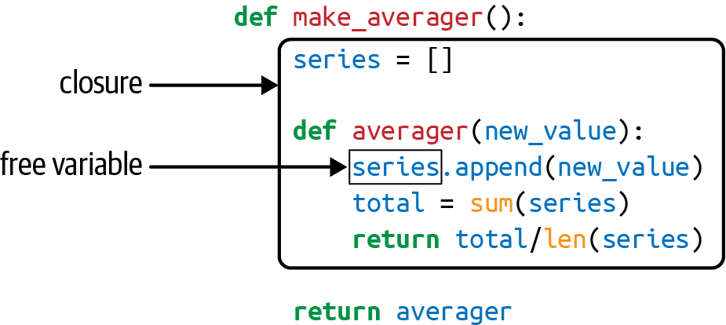

# 定义(what)

## 官方定义

维基百科对 closure(闭包)的定义为(https://en.wikipedia.org/wiki/Closure_(computer_programming))：

> In programming languages, a closure, also lexical closure or function closure, is a technique for implementing lexically scoped name binding in a language with first-class functions. Operationally, a closure is a record storing a function together with an environment(在编程语言中，**闭包**(也称为：词法闭包、函数闭包)**是一种**在支持头等函数的语言中实现名字绑定的**技术**。从**实现上**看，**闭包是一个**存储"函数+与函数关联的环境"的**结构体**)....

上面的定义非常抽象及拗口，简单来说就是：闭包是一种用来实现名字绑定的技术。

**说明**：

- first-class function(头等函数/一等函数)

头等函数是指在程序设计语言中，函数被当作头等公民。这意味着，函数可以作为别的函数的参数、函数的返回值，赋值给变量或存储在数据结构中。

- name binding(名字绑定/名称绑定)：

将名字和值进行绑定。示例：

```
number = 1024
```

-  lexically scoped name binding

作用域确定的名字绑定(scoped name binding)，作用域基于词法分析(lexically)确定。

- record

todo：不好解释，待补充。

## 自定义

如果一个内部函数(inner function)对外部函数(outer function)的变量进行引用，且外部函数的返回值是内部函数，那么这个内部函数称为闭包(closure)。

# 动机(why)

todo.

# 实现(how)

```python
def make_averager():
    series = []

    def averager(new_value):
        series.append(new_value)
        total = sum(series)
        return total / len(series)

    return averager


if __name__ == '__main__':
    avg = make_averager()
    print(avg(10))  # 输出 10.0
    print(avg(20))  # 输出 15.0
    print(avg(30))  # 输出 20.0
```




上述代码和图来自于《Fluent Python 2ed》。

# 实战(where)

# when

# who

# 参考资料

[1] wiki, Closure (computer programming): https://en.wikipedia.org/wiki/Closure_(computer_programming)

[2] PEP 227 – Statically Nested Scopes: https://peps.python.org/pep-0227

[3] PEP 3104 – Access to Names in Outer Scopes: https://peps.python.org/pep-3104